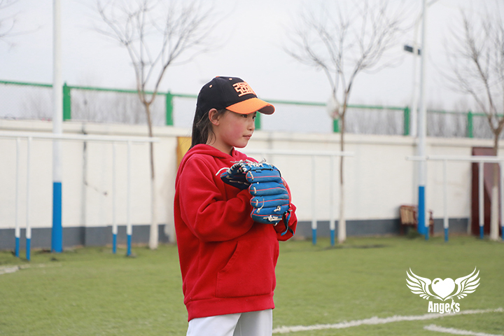
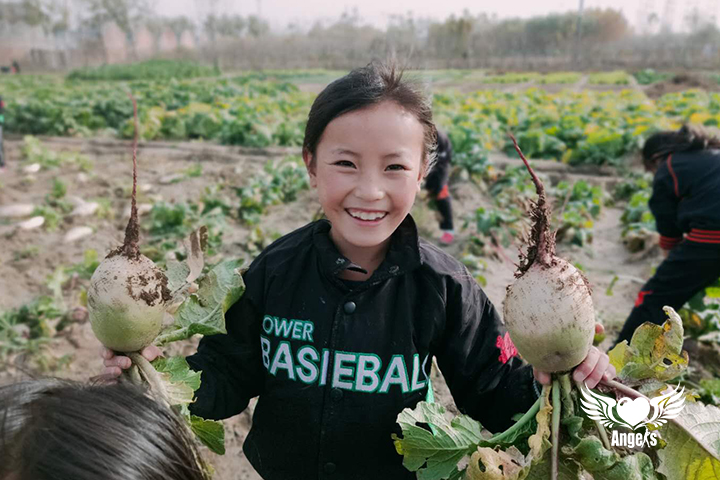
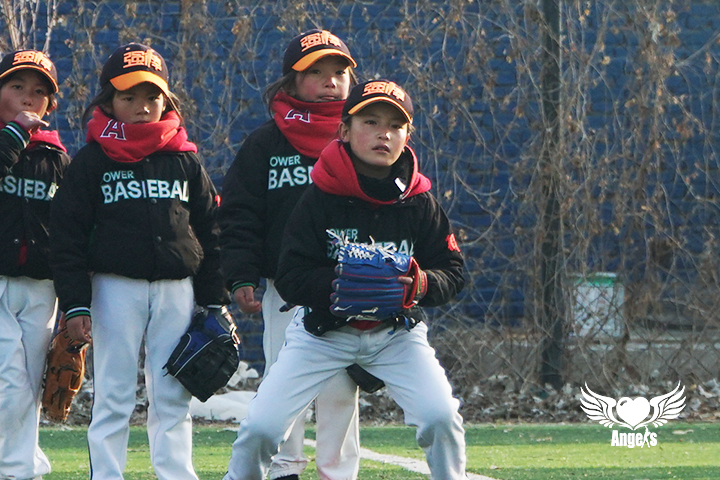
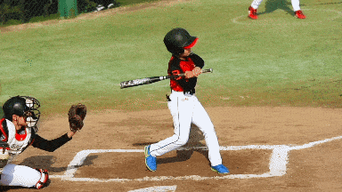

## 吾尔作曲的小采访
*一个娇俏可爱的小美人，娇羞恬静之中透着活泼，在嘴角有两个浅浅的酒窝时常亮起，活像个童话故事的小公主* 

#### 你叫什么名字呀？
> 我的名字是吾尔作曲

#### 你可以介绍下自己吗？
> 嗯嗯，我出生在2011年7月8日，我是2020年9月加入强棒基地的，我的老家在四川凉山州，我是彝族

#### 你平时的兴趣爱好有哪些呀？
> 我喜欢画画，最擅长的科目是数学。我很喜欢打棒球

#### 什么时候开始学习棒球的？
> 去年进到棒球基地的时候

#### 每天的棒球训练时长是多久？
> 下午1点50到4点半

#### 在棒球基地的一天是如何度过的呢？
> 早晨7点起床吃早饭，上午上课，有语文，数学，画画。每天最喜欢学习和画画，还会参加劳动

#### 棒球学习过程中遇到过什么困难或问题？是如何克服这些问题的？
> 教练有时会批评，也会指出自己的错误，但是都会去接受这些指正，因为这些意见都会让自己成长

#### 你的愿望是什么？
> 当一名老师

#### 如果没有棒球，你觉得你的人生是什么样子？
> 没有棒球，自己会很不开心，是棒球给自己带来了快乐

*是强棒天使项目帮助这群孩子成长成才* 

*** 

##### References
图片来源: 强棒少女项目组 
